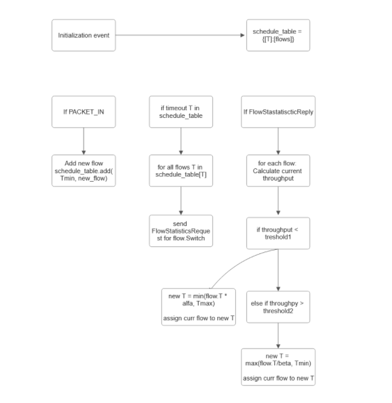

# Projekt na Sieci Sterowane Programowo

## Skład zespołu

Konrad Pękala, Marcjanna Bąkowska, Marek Borkowski

## Topologia

W naszym rozwiązaniu użyjemy [topologii polskiej](https://sndlib.put.poznan.pl/home.action?fbclid=IwZXh0bgNhZW0CMTEAAR3tA3f6QjfDBMvHCTL5tdeqrTLAXejLmolCGpzL3xaQmjhuOEpV4jYTQyM_aem_m1RIC6h83HPIrBJi2hVbdQ)

## Instalacja / Uruchomienie

Aby pobrać projekt w środowisku Floodlight VM należy wpisać w konsoli `git clone https://github.com/kpekala/floodlight-sdn-project.git`

Skrypt python służący do instalacji urządzeń mininet znajduje się w katalogu mininet/init_net.py.

Aby go uruchomić wystarczy wpisać w konsoli `sudo python ./mininet/init_net.py`
Warto po każdym uruchomeniu wpisać `sudo mn -c` aby wyczyścić środowisko mininet

### Uruchomienie generatora ruchu

1.W pliku topology_final.py zostało zaimplementować uruchamianie serwerów iperf3 na hostach h3 i h4.  
2. Następnie w pliku topolgy_final.py wywoływane są skrypty które uruchamiają ruch iperf miedzy h1 a h3 i h2 i h4 dla wylosowanego portu.

## Algorytm

Pseudokod algorytmu znajduję się w folderze algorithm.

Link do publikacji: https://ieeexplore.ieee.org/document/6838227 .

## Instalacja środowiska

Korzystamy z wersje OF 13, po zainstalowaniu floodlighta z brancha master. Potrzebna jest do tego Java 8.

Link do instalacji środowiska: https://floodlight.atlassian.net/wiki/spaces/floodlightcontroller/pages/1343544/Installation+Guide
(Występuje jednak dużo błędów w międzyczasie, linki do naprawienia niektórych z nich znajdują się poniżej)

Potrzebna jest Java wersja 8, aby wersja masterowa Floodlighta działała. Instrukcja: http://www.webupd8.org/2012/09/install-oracle-java-8-in-ubuntu-via-ppa.html
Może jednak pojawić się błąd, przy komendzie: sudo add-apt-repository ppa:webupd8team/java

Wtedy należy skorzystać z porady po linkiem: sudo add-apt-repository ppa:webupd8team/java 
Komenda: sudo apt-get install --reinstall ca-certificates powinna pomóc.

Potem przy instalacji oracle javy może się pojawić informacja, że nie znaleziono tego pakietu. Należy zainstalować jave jdk, tak jak opisano w tym wątku: https://serverfault.com/questions/972517/java-installation-error-on-debian-8.

Potem mogą pojawić się problemy przy budowaniu zklonowanego repozytorium komendą ant. Trzeba się upewnić, że jest dodana Java 8 do zmiennych środowiskowych i że w eclipse jest dodana pod Java Runtime Environment (JRE). (External Tools Configuration -> JRE -> Separate JRE -> Installed JREs -> Add (upewnij się że ścieżka jest taka analogiczna jak w Javie 7) -> wybierz Jave 8)

Mimo to podczas kompilacji pojawi się dużo errorów związanych z tym, że nie widzi jakichś modułów, polecam wtedy ten filmik: https://www.youtube.com/watch?v=nrSKOfaMN6g i postępować dokładnie jak w nim jest.
